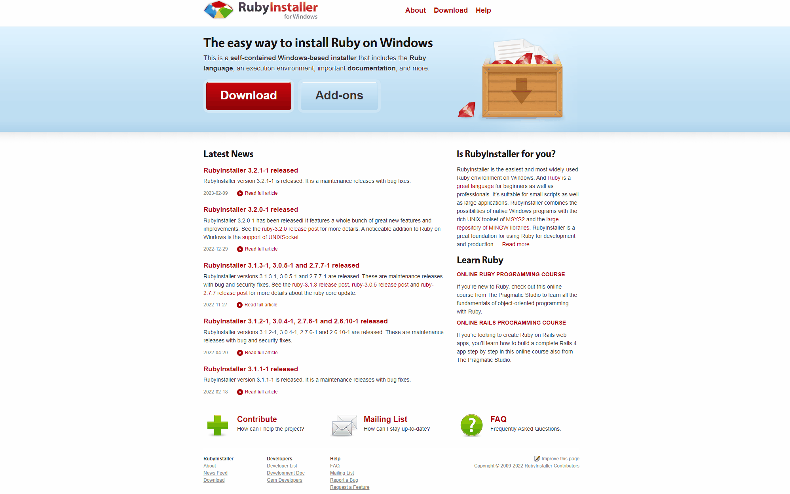
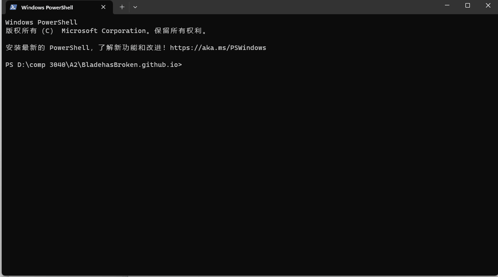
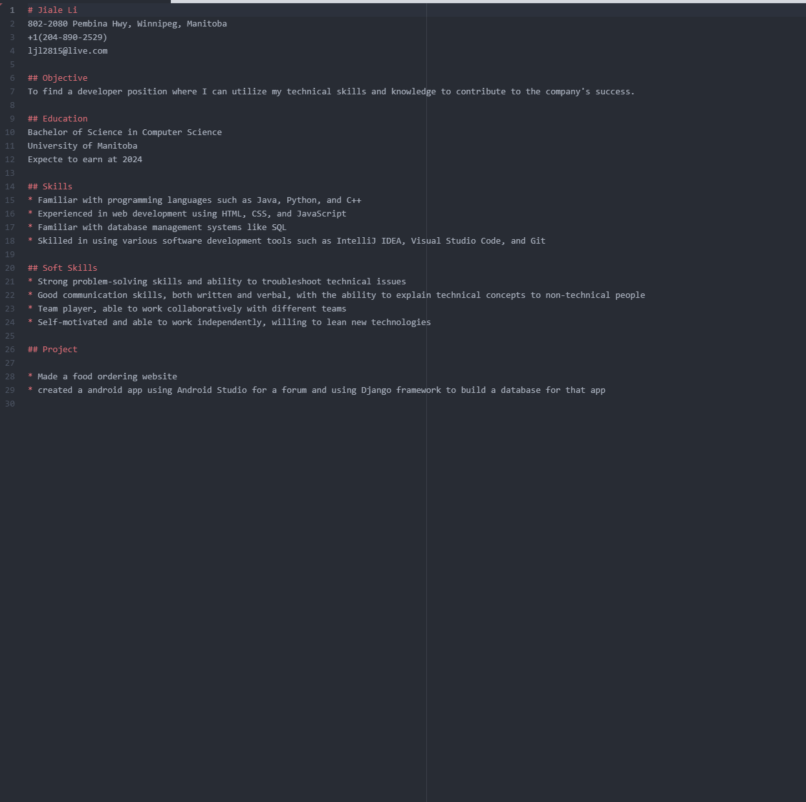
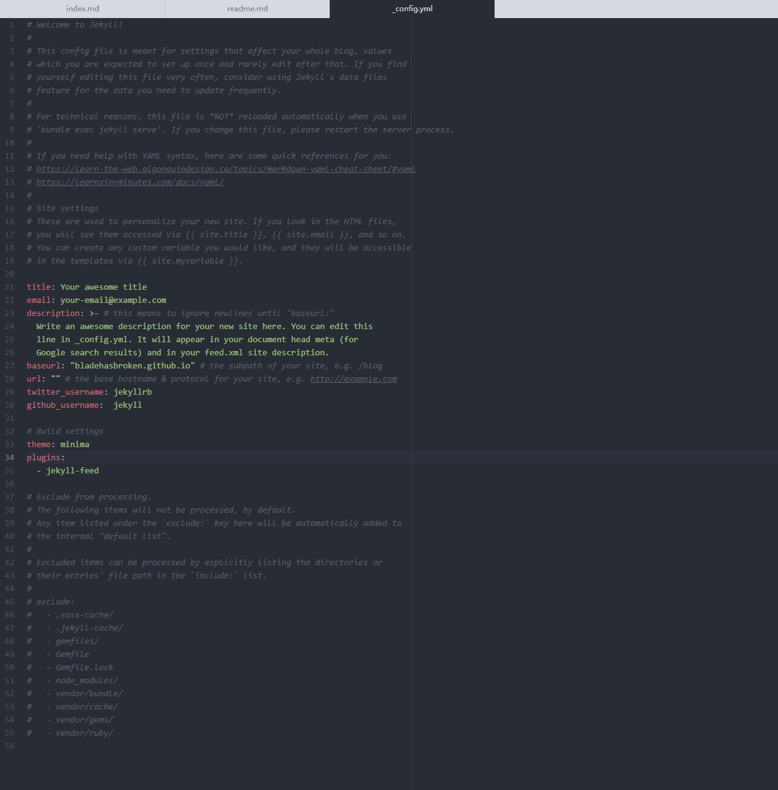
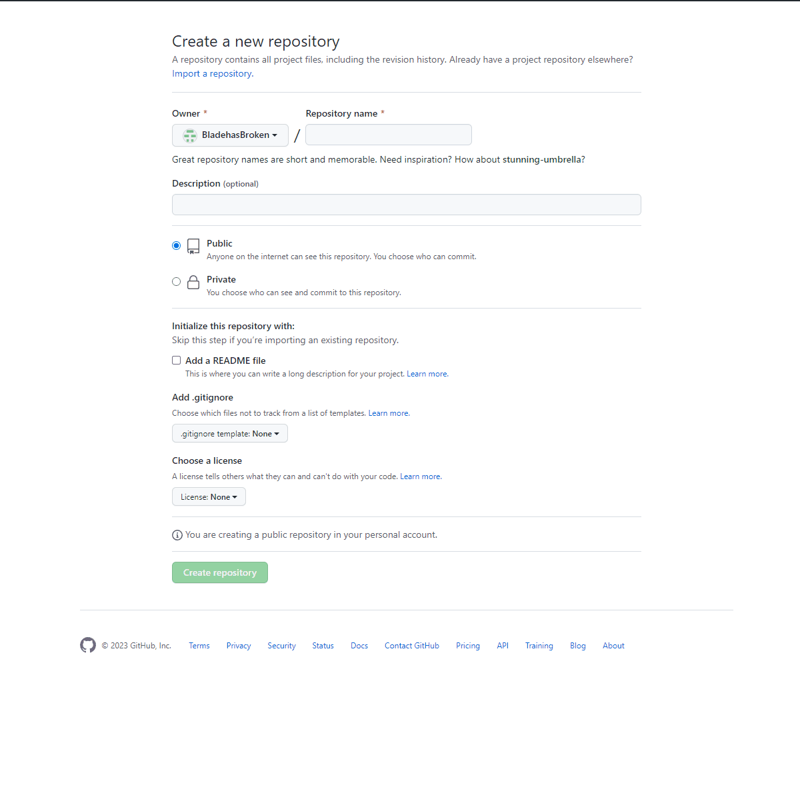
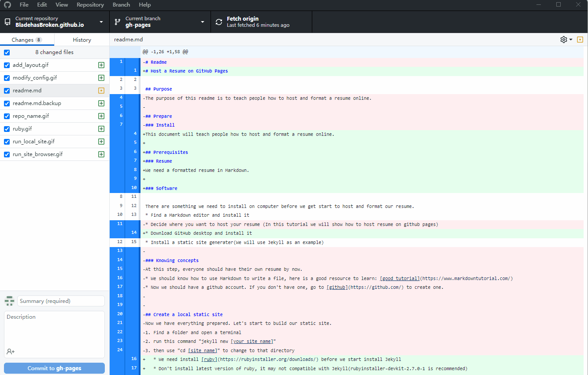
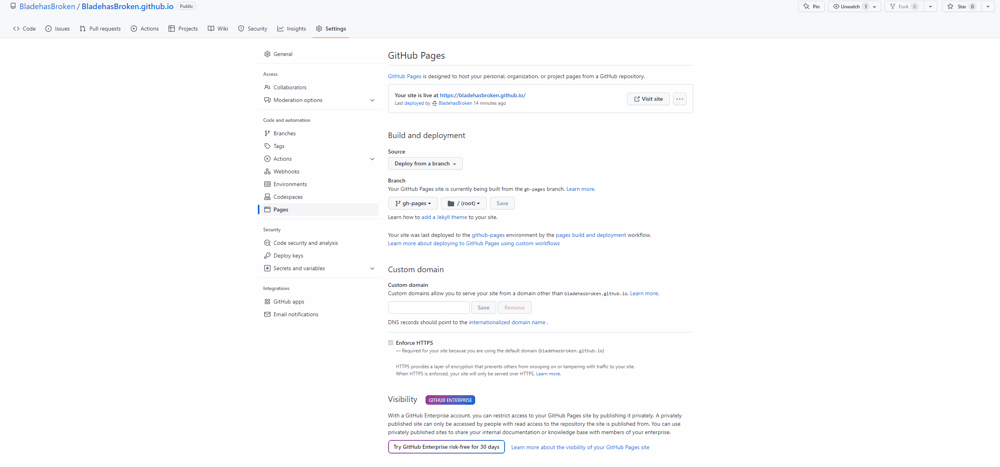

# Host a Resume on GitHub Pages

## Purpose  
This document will teach people how to host and format a resume online.  

## Prerequisites  
### Resume
We need a formatted resume in Markdown.  
(This follows the rules of "use lightweight MarkUp" in *Modern Technical Writing*. Markdown is a very popular MarkUp language worldwide, it has clean syntax and can easily be opened by a web browser.)

### Software

There is something we need to install on the computer before we get to start to host and format our resume.  
* Find a Markdown editor and install it
* Download the GitHub desktop and install it
* Install a static site generator(We will use Jekyll as an example)  
	* We need to install [ruby](https://rubyinstaller.org/downloads/) before we start to install Jekyll
	* Don't install the latest version of ruby, it may not compatible with Jekyll(rubyinstaller-devkit-2.7.0-1 is recommended)

## Instruction  
### Make Local Static Site  
(This follows "make static websites" in _Modern Technical Writing_.  
A static website only needs a few hardware resources and it is very safe. It can easily modify the content by making changes in lightweight markup files.)
1. Create a folder and open a terminal on your computer
2. Run this command "jekyll new [your site name]"
3. Use "cd [your site name]" to change to that directory
4. run "bundle exec jekyll serve" to generate the site the first time, you only need to run "jekyll serve" after the first time.
5. Then copy and paste the URL at the Serve address to our browser, and you can see our site locally.  
(Note: don't close the terminal when we run our local site)

6. Move our resume into this root folder  
7. Delete the default "index.md"  
8. Add "---  
&emsp; &ensp; &ensp;layout: home  
&emsp; &emsp; ---"  
in our "resume.md"  
9. Rename the resume to "index.md"  
10. Delete everything in "_config.yml" except theme and plugins  
11. Delete any files that are in the post folder  

 

 
Now our resume should at the home page.  

### Put Static Site In GitHub Pages  
1. Go to [GitHub](https://github.com/) and log in to your account  
(This follows the "use distributed version control in _Modern Technical Writing_."  
GitHub is the most popular distributed version control in the world, it allows developers to keep track of the workflow.)
2. Create a new repository by clicking the "+" at the top right corner
3. Set repository name in this format: [your account name].github.io
(Note: don't add readme file by default)

4. Open GitHub Desktop and clone the repository that we just created  
5. create a new brank called "gh-pages"  
6. copy every file that is in our local site folder and paste it to the repository folder  
7. Commit these files and push them to GitHub  
(These steps follow "Rsync" in _Modern Technical Writing_. The GitHub Desktop can keep updated between the developer's computer and the repository on GitHub. So that the online repository can always have the newest files.)
8. Go to Settings on your repository page on GitHub
9. Go to the Pages that you can find at navigate bar on the left
10. Set the Source to "Deploy from a branch"
11. Set the Branch to "gh-pages" and select folder from "root"
12. Wait for a few minutes, we can see our resume is on the website  
(The URL is the same as our repository name)

### More Resources  
* We should know how to use Markdown to write a file, here is a good resource to learn: [good markdown tutorial](https://www.markdowntutorial.com/)
* [_Modern Technical Writing: An Introduction to Software Documentation_](https://www.amazon.ca/Modern-Technical-Writing-Introduction-Documentation-ebook/dp/B01A2QL9SS)
* We should have a GitHub account. If you don't have one, go to [GitHub](https://github.com/) to create one.  
* Here are some good resources for [Jekyll](https://jekyllrb.com/resources/)  

## FAQs  
1. Q: "Why is Markdown better than a word processor ?"  
A: "Markdown has cleanest Syntax, and it can be easily open by any web browser and other text editor."
2. Q: "Why is my resume not showing up ?"  
A:"First check the _config.yml to see if erevything correct.   
second, try to upload the whole local site folder to GitHub repository.  
Third, GitHub could be down, just wait until GitHub online."
3. Q: "Why I fail to intall Jeckyll on my computer ?"  
A: "Maybe it's because you install the newest version of ruby, try to install this version: **ruby+devkit-2.7.0-1**. Don't forget to intall developemnt kit after install ruby."

## Contact  
Jiale Li - lij34556@myumanitoba.ca  
Project Link: https://github.com/BladehasBroken/BladehasBroken.github.io/tree/gh-pages  

## Acknowledgments  
(This component follows "the legal problem" in _Modern Technical Writing_. I add some references that I have used in this project, so that I won't be involvded in legal problems.)
* [Jekyll](https://jekyllrb.com/)
* [GitHub Pages](https://pages.github.com/)
* [Jekyll Tutorial By Mike Dane](https://www.youtube.com/playlist?list=PLLAZ4kZ9dFpOPV5C5Ay0pHaa0RJFhcmcB)  
* [Modern Technical Writing: An Introduction to Software Documentation](https://www.amazon.ca/Modern-Technical-Writing-Introduction-Documentation-ebook/dp/B01A2QL9SS)